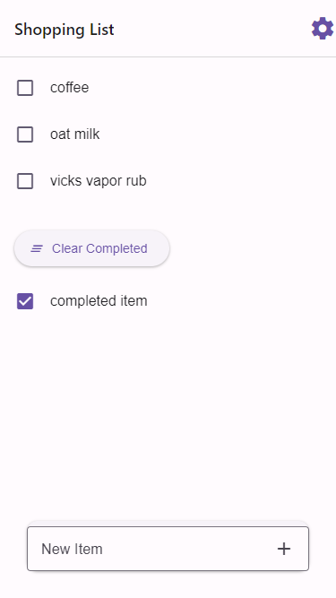
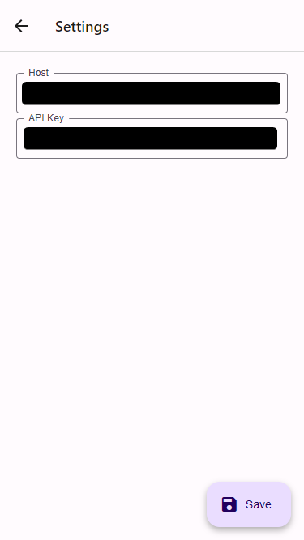

# Unofficial Home Assistant Shopping List App

A basic standalone shopping list app for Home Assistant.

## Description

The shopping list functionality from home assistant is really awesome. However, it can be challenging to use sometimes in practice as it it buried within the side menu of the companion app. Having a separate app lets your non-techy household member easily open it up with single click.

### Features

- Super simple, just a checklist and a settings page
- Allow creating, completing and clearing shopping list items
- Connects to WebSocket API for realtime updates.

### Built with

- Expo
- React Native
- TypeScript
- TaskFile
- My Ever Dwindling Free Time

## Getting started

Download the APK from the releases or clone the repo and build the project yourself. (if you have TaskFile installed just run `task apk`). Then install on your device.

### Prerequisites

Dependencies not explicitly covered in the installation process; e.g., OS restrictions.

## Back matter

### Legal disclaimer

Usage of this tool for attacking targets without prior mutual consent is illegal. It is the end user's responsibility to obey all applicable local, state, and federal laws. Developers assume no liability and are not responsible for any misuse or damage caused by this program.

### Acknowledgements

Thanks of course to the awesome Home Assistant project for helping me program my house!

### See also

- [Home Assistant](https://www.home-assistant.io/)

### To-do

- [ ] Better Loading/Error Screens
- [ ] iOS Build Configuration (PRs welcome)

### License

This project is licensed under the [MIT License](LICENSE.md).
